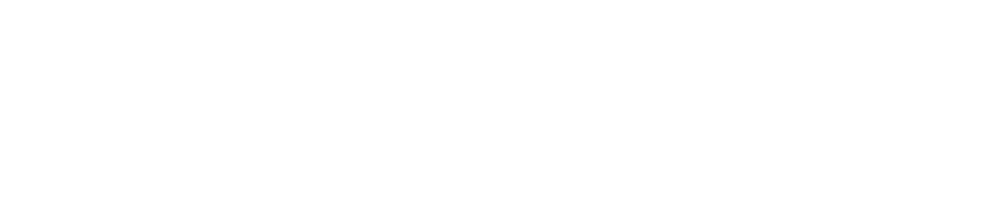
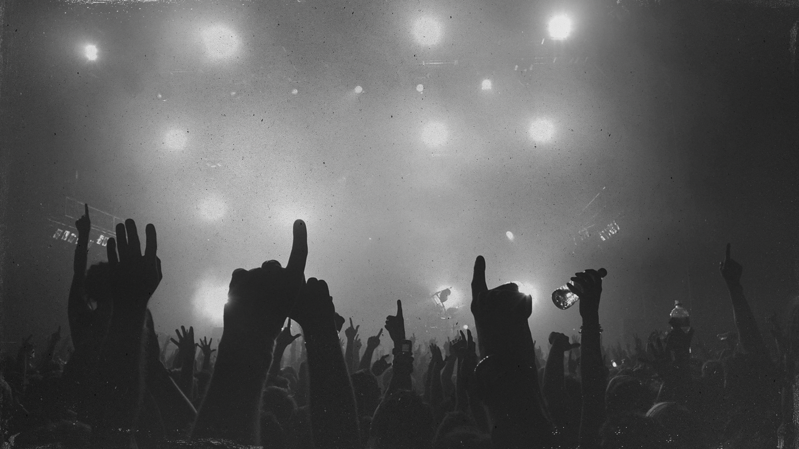
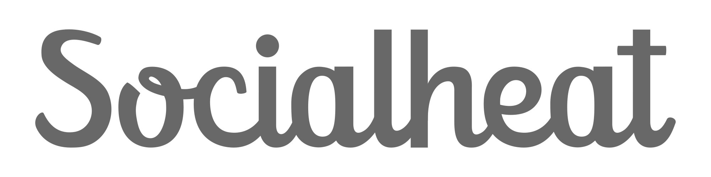

---

layout: default

style: |

    .caption img{
        width: 10em;
    }
    #Cover h2 {
        margin:90px 0 0;
        color: transparent;
        text-align:center;
        font-size:70px;

        }
    #Cover p {
        margin:10px 0 0;
        text-align:center;
        color:#3C3D40;
        font-style:italic;
        font-size:35px;
        }
    #Cover div h2 img {
        position: inherit;
        width: 7em;
        height: 2em;
        z-index: 1;
    }
    #Contacts div h2 img {
        position: inherit;
        width: 7em;
        height: 2em;
        z-index: 1;
    }
    #Cover p img{
        width: 1024px;
        height: 640px;
    }
        #Cover p a {
            color:#3C3D40;
            }
        #Cover p.note {
            color: #999;
            margin-top: 190px;
            font-size:22px;
        }
        #Cover p.note a{
            color: #999;
        }
    .cover img {
        width: 1024px;
        height: 640px;
    }
    #Picture h2 {
        color:#FFF;
        }
    #SeeMore h2 {
        font-size:100px
        }
    #SeeMore img {
        width:0.72em;
        height:0.72em;
        }
    #reklamos-srautas-akina h2{
        color: #FFF; 
    }
    #informacijos-filtras h2{
        color: #FFF; 
    }
---

#  {#Cover}
*Mobili aplikacija renginių atradimui*

{:.note}
Twitter: [@SocialheatApp](http://twitter.com/SocialheatApp) WWW: [Socialheat.lt](http://socialheat.lt)

## Reklamos srautas akina
{:.cover .shout}

## Informacijos filtras
{:.cover }

## Kas atiminėja mums givybes

1. …Mes patys per protingi...
2. …Berlynas ir Kaunas skiriasi... 
3. …Keistas noras susipažinti su gamta.

## Naujas gyvenimo būdas

1. …Kalbėjimas su nepažystamais žmonėmis
2. …Berlyne ir Kaune tiek pat čeburiekinių
3. …Miškuose galima pagauti internetą... jei esi pakakmai aukštoj pušy

## Krištolinio rutulio transliacija

1. Šio mėnesio gale mokamos beta launchas (1$)
2. Suartys dėl srauto tiekimo bent su trimis kompanijomis
3. Išskirtinės teisės į keletos tarptautinių renginių publikavimą

##Komanda

* Povilas
* Mantas
* Darius
* Tautvydas

##  {#Contacts}
 info@socialheat.lt

 +370 623 56 228
 
 http://socialheat.lt